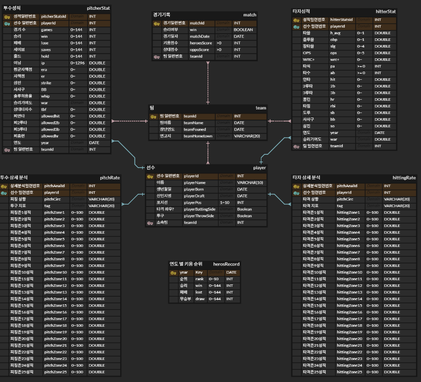

# HeroesSaber

## 0. 시작하기
`cd heroessaber && flutter run -d chrome --web-renderer html `

 

## 1. 프로젝트 소개
### TEAM MEMBER
<table>
  <tbody>
    <tr>
      <td align="center"  width="16.66%"><a href="https://github.com/Johyeonwoooooooo"> <b>조현우</b></a> BackEnd, Crawling</td>
        <td align="center"  width="16.66%"><a href="https://github.com/dabeann"> <b>장윤영</b></a> BackEnd, FrontEnd</td>
  </tbody>
</table>

 

### 소개: 
> 본 프로젝트에서는 키움 히어로즈 선수단에 특화된 야구 선수 스탯을 제공하는 웹서비스를 개발하고자 한다.

### 주요 기능
1. 경기 일정 및 결과 제공
2. 선수 세부 스탯 제공 - 기록에 기반한 선수 분석 결과 제공
3. 히어로즈 외 타 구단 선수 등록

 

## 2. DB 구성

https://www.erdcloud.com/d/3St2L5pv2v7HiftHE

 

## 3. 기능 & 화면
#### 메인 페이지

> 각 월의 경기 결과와 현재 순위, 승, 패를 보여준다.

> OPS 기준 타자 순위, ERA 기준 투수 순위를 보여준다.

> 다음 경기 결과와 히어로즈 관련 사이트들을 보여준다.

#### 선수 기본 정보

- 투수

> 키움 로고와 선수 이미지 및 선수 기본 정보를 보여준다.

> 1년간의 기록을 보여 준다. 더보기를 누르면 세부 정보 페이지로 이동한다.

> 대표적인 세부 스탯을 보여준다.

- 타자

> 키움 로고와 선수 이미지 및 선수 기본 정보를 보여준다.

> 1년간의 기록을 보여 준다. 더보기를 누르면 세부 정보 페이지로 이동한다.

> 대표적인 세부 스탯을 보여준다.

#### 선수 세부 정보
- 투수

> 스탯에 기반한 분석 결과를 보여준다.

> 세부 스탯

- 타자

> 스탯에 기반한 분석 결과를 보여준다.

> 세부 스탯

#### 선수 등록

> 원하는 선수의 이름을 검색해 등록할 수 있다. 단, 2024 KBO 리그에서 뛴 선수에 한해서만 가능하며 동명이인은 불가하다.